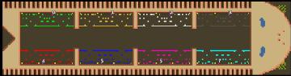

> **ARCHIVED**: This is an archive of an old map / mod from the old Addons site.

### [Map]

> [!IMPORTANT]
> This is an old map format. **Updated versions of maps are available in the Warzone 2100 Maps Database.**

# Mero_Centipede

| | |
| - | - |
| __Author:__ | Merowingg |
| Addon-type: | __Map__ |
| __Game Version:__ | 3.1.1 |
| Created: | May 4, 2014, 11:29 a.m. |
| Oil: | Low |
| Players: | 8 |
| Bases: | Advanced Bases |
| __License:__ | CC-BY-SA-3.0 OR GPL-2.0-or-later |

> File: [8cMero_Centipede.wz](https://github.com/Warzone2100/old-addons-site/raw/main/assets/266/8cMero_Centipede.wz)  
> SHA256: eef50d96f16079a499c4c4a14a996450dc228e548dab241402edca89a07e58c3

## Description:

Hello Gentlemen,

I got inspired by the map with the same name. It is called Centipede, because it is at least supossed to resemble of how a centipede looks like.

The map is for eight players. 250x65 so very wide, but short in lenght. There is four oils per player. Advanced bases are include with walls and mahinegun towers only.

Have fun gentlemen,

Regards,

Mero.

