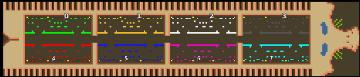

> **ARCHIVED**: This is an archive of an old map / mod from the old Addons site.

### [Map]

> [!IMPORTANT]
> This is an old map format. **Updated versions of maps are available in the Warzone 2100 Maps Database.**

# Mero_Woodlouse

| | |
| - | - |
| __Author:__ | Merowingg |
| Addon-type: | __Map__ |
| __Game Version:__ | 3.1.1 |
| Created: | May 4, 2014, 11:31 a.m. |
| Oil: | Low |
| Players: | 8 |
| Bases: | Advanced Bases |
| __License:__ | CC-BY-SA-3.0 OR GPL-2.0-or-later |

> File: [8cMero_Woodlouse.wz](https://github.com/Warzone2100/old-addons-site/raw/main/assets/267/8cMero_Woodlouse.wz)  
> SHA256: c90dd127f77df87f5786ca5249ea919cd020ba44c015f3e71d896692bc95db2a

## Description:

The Woodlouse is the more insane version of Centipede. Even more narrow in lenght.

The map is for eight players. 250x52 so very wide, but short in lenght. There is four oils per player. Advanced bases are include with walls and mahinegun towers only.

Have fun Gentlemen.

