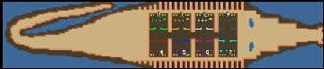

> **ARCHIVED**: This is an archive of an old map / mod from the old Addons site.

### [Map]

> [!IMPORTANT]
> This is an old map format. **Updated versions of maps are available in the Warzone 2100 Maps Database.**

# Mero_Crocodile

| | |
| - | - |
| __Author:__ | Merowingg |
| Addon-type: | __Map__ |
| __Game Version:__ | 3.1.1 |
| Created: | May 4, 2014, 11:33 a.m. |
| Oil: | Low |
| Players: | 8 |
| Bases: | Advanced Bases |
| __License:__ | CC-BY-SA-3.0 OR GPL-2.0-or-later |

> File: [8cMero_Crocodile.wz](https://github.com/Warzone2100/old-addons-site/raw/main/assets/268/8cMero_Crocodile.wz)  
> SHA256: ae643ac3a40b047f679e7510bd98ace9c2df4433fa838e616c9ca349ed9bc703

## Description:

Hello Gentlemen,

I believe I dont have to say why it is called Crocodile.

The bases here have 14x14 tiles areas, so very small. 4 oils per player. Basic structures in minimal amount with two machineguard towers at the gate. I have left some place if 10 player version was needed.

Have fun,

Regards,

Mero

