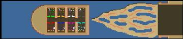

> **ARCHIVED**: This is an archive of an old map / mod from the old Addons site.

### [Map]

> [!IMPORTANT]
> This is an old map format. **Updated versions of maps are available in the Warzone 2100 Maps Database.**

# Mero_Bullet

| | |
| - | - |
| __Author:__ | Merowingg |
| Addon-type: | __Map__ |
| __Game Version:__ | 3.1.1 |
| Created: | May 18, 2014, 6:27 p.m. |
| Oil: | Low |
| Players: | 8 |
| Bases: | Advanced Bases |
| __License:__ | CC-BY-SA-3.0 OR GPL-2.0-or-later |

> File: [8cMero_Bullet.wz](https://github.com/Warzone2100/old-addons-site/raw/main/assets/269/8cMero_Bullet.wz)  
> SHA256: 780aa09d5ca2b3eb3e6ef16d44c2ad252fb8fe14149954ba6bd6cb43834b5355

## Description:

Hello Gentlemen,

The map is called Bullet because all the eight players are inside the bullet fired from a gun. I also believe that games on this map will be fast as bullets, but who knows.

The bases are 10x14 tiles, so almost claustrophobic so beware of what and where do you build. Basic structures with two mahinegun towers at the gate. The bullet is really small in general. There is four oils at each base.

I hope you will enjoy it.

Regards,

Mero

