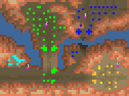

> **ARCHIVED**: This is an archive of an old map / mod from the old Addons site.

### [Map-Mod]

> [!IMPORTANT]
> Mods (or map-mods) **may not work properly or cause crashes / broken behavior** if used with a version of Warzone 2100 other than the one specified below

# The Paradigm

| | |
| - | - |
| __Author:__ | NoQ |
| Addon-type: | __Map-Mod__ |
| __Game Version:__ | 3.1.0 [^1] |
| Created: | March 22, 2013, 8:53 p.m. |
| Oil: | Low |
| Players: | 4 |
| Bases: | Advanced Bases |
| Player Mode: | Skrimish/MP |
| Mod Category: | AI |
| __License:__ | CC0-1.0 |

> File: [4cTheParadigm.wz](https://github.com/Warzone2100/old-addons-site/raw/main/assets/27/4cTheParadigm.wz)  
> SHA256: a9fdec0a333936959f7ecd3a456d52745fdf21557c6993333034e02a37fc810a

## Description:

*INSTALL TO MODS AUTOLOAD* 

*then choose the challenge*

A single player challenge with custom AIs. Story follows.

_________________________

It was a quiet Arizona morning. Wind was gently shaking the branches of white mutant Arizona pine trees, making a beautiful peaceful sound. In fact, i thought this sound was funny when i heard it for the first time, but now i am kind of used to it.

- Excuse me Sir! Scavenger scouts report that we are under attack by the forces of the Project!

I wake up and look at the clock. It's 3:45AM Universal New Paradigm Time. 

Ouch.

Why it has to be my birthday?  In fact, i have no idea when my birthday is. Right now I was planning to celebrate the day when the New Paradigm boys picked me up starving in the middle of nowhere in some sandy valley a couple of years ago. This seems to be some sort of second life for me; I don't feel anything about their ideology, but I'm greatful to them, they recognize my ... talents ... as a commander, and i made some good friends here to. Huh. They surely know the right time to attack 

I'm picking up the synaptic link phone and calling our chief to report the situation. What the hell? 

"Error 272 establishing connection: The Secure Synaptic Link certificate is out of date."

Oh crap, when did they update that one? Pushing the intelligence reports button. "The Project Heavy Body is captured and ready for analysis." No, not that one ... "Arizona bushes were proven to be bad for health." No, not this one either ... Here it is! "SSL certificate update. We're switching to a more secure way of delivering the certificates. It should be harder to hack; please provide your feedback." 

- Ehm, lieutenant, did we recieve anything ... emmm ... any paper recently?

- Yes Sir! Tonight we caught a carrier pigeon with some paper attached! It had some digits on it!

A carrier pigeon?  That's surely a secure way of pre-sharing the key. I think the Project would have caught that pigeon when they saw it even if it weren't carrying a secret code. 

Well, fine. Seems to work now.

- Hello? Oh commander, what's up man?

He sounds pretty fresh. Probably was celebrating something tonight, still awake. 

- Hey chief, sorry to interrupt but we're sort of under attack down there.

- Under attack? Hmm, you never had a problem with that. Any chance to survive?

- Emm, we're having as many as four cannon borgs against a pretty tough tracked army of machineguns and cannons. Will hold for a while, of course ...

- Ok fine, I'm sending you 2500 New Paradigm Dollars of energy, should be enough to get some army done. Don't forget to send the standard warning. gl.

- hf chief ... 

Not being sure he understood anything, i'm pressing the "Play" button. 

"Your attacks will not go unpunished. You are in contravention of the New Paradigm. You will be destroyed. gl."

Why the hell do i have to play this stupid video? They surely won't call it a masterpiece or give me a candy for that. 

[^1]: This archived mod is only tested with this older version of Warzone 2100, and is unlikely to work with more modern versions as-is.
