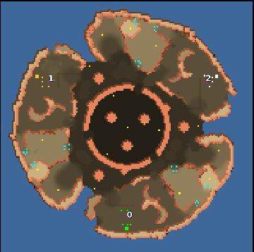

> **ARCHIVED**: This is an archive of an old map / mod from the old Addons site.

### [Map]

> [!IMPORTANT]
> This is an old map format. **Updated versions of maps are available in the Warzone 2100 Maps Database.**

# trefoil

| | |
| - | - |
| __Author:__ | montetank |
| Addon-type: | __Map__ |
| __Game Version:__ | 3.1.1 |
| Created: | June 1, 2014, 2:40 p.m. |
| Oil: | Medium |
| Players: | 3 |
| Bases: | Normal bases |
| __License:__ | CC-BY-3.0 OR GPL-2.0-or-later |

> File: [3ctrefoil.wz](https://github.com/Warzone2100/old-addons-site/raw/main/assets/270/3ctrefoil.wz)  
> SHA256: e09eef00b4b3514ce3d3175c1ae8e1cb5e57d2c40b1a6f907a8e613ba1eff26c

## Description:

4 oils at base. 16 oil/terrain. It is very hard to defend the base, because the enemy has 4 possibilities to attack the base. One with hovers. The scavs are only with defense bunkers without units/factories. Against NullBot it makes more fun to play without the scav-bunkers

