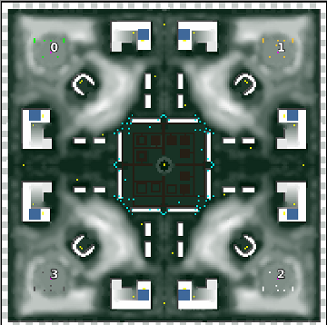

> **ARCHIVED**: This is an archive of an old map / mod from the old Addons site.

### [Map]

> [!IMPORTANT]
> This is an old map format. **Updated versions of maps are available in the Warzone 2100 Maps Database.**

# Iceage

| | |
| - | - |
| __Author:__ | montetank |
| Addon-type: | __Map__ |
| __Game Version:__ | 3.1.1 |
| Created: | June 1, 2014, 2:38 p.m. |
| Oil: | Medium |
| Players: | 4 |
| Bases: | Normal bases |
| __License:__ | CC-BY-3.0 OR GPL-2.0-or-later |

> File: [4cIceage.wz](https://github.com/Warzone2100/old-addons-site/raw/main/assets/271/4cIceage.wz)  
> SHA256: c683486c085b66dab7778a97a8b0f2ae680a29198ae90c1aaa4c22afb9294f96

## Description:

In the new Ice age the scavs captured a city with a large science center. They are now in possession of new wall-structures and weapons. But they are not strong enough. So-a short trip into the last green city with his worthwhile destinations (6 oil) could be a good idea. 

Have fun

