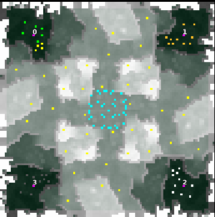

> **ARCHIVED**: This is an archive of an old map / mod from the old Addons site.

### [Map]

> [!IMPORTANT]
> This is an old map format. **Updated versions of maps are available in the Warzone 2100 Maps Database.**

# smilingthird

| | |
| - | - |
| __Author:__ | montetank |
| Addon-type: | __Map__ |
| __Game Version:__ | 3.1.1 |
| Created: | May 31, 2014, 3:03 p.m. |
| Oil: | Medium |
| Players: | 4 |
| Bases: | Normal bases |
| __License:__ | CC-BY-3.0 OR GPL-2.0-or-later |

> File: [4cSmilingthird.wz](https://github.com/Warzone2100/old-addons-site/raw/main/assets/272/4cSmilingthird.wz)  
> SHA256: df66fa5c6cceb2c34c286a0d481566387b166afefedc4bb69cd2bff06b77dd44

## Description:

A map for players, who are professionals in near battles and masters in unit-handling. Theres is no direct way to the enemies. You have to choose the way to the center of the map. Here are the fight for the oil. I like this map. Without scavs there is action against strong nullbots after 3 minutes. I needed 4 attempst to win. Very hard. 

Find your strategy. It is not a map for the research and defense-players. Have fun

