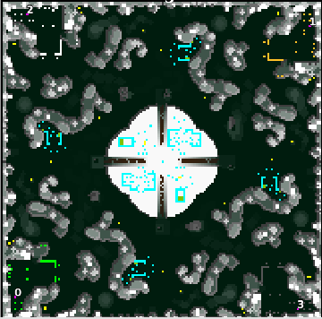

> **ARCHIVED**: This is an archive of an old map / mod from the old Addons site.

### [Map]

> [!IMPORTANT]
> This is an old map format. **Updated versions of maps are available in the Warzone 2100 Maps Database.**

# MontenegroB

| | |
| - | - |
| __Author:__ | montetank |
| Addon-type: | __Map__ |
| __Game Version:__ | 3.1.1 |
| Created: | June 1, 2014, 2:33 p.m. |
| Oil: | Medium |
| Players: | 4 |
| Bases: | Advanced Bases |
| __License:__ | CC-BY-3.0 OR GPL-2.0-or-later |

> File: [4cMontenegroB.wz](https://github.com/Warzone2100/old-addons-site/raw/main/assets/273/4cMontenegroB.wz)  
> SHA256: 6ad127b1643f6cbcbb3282a74f308a9366a49470346bbceb4e4749767e22f4bb

## Description:

4-player-map (size 160/160). Symmetric. (some features not). 4 derricks at the base +28/terrain. But the scavs are the problem. There is a large scavenger presence at the center of the map on a very high plateau, controling 8 oils. Destroying them and claiming their oil is a top priority if you want to win

