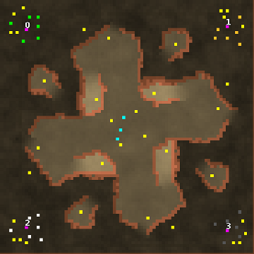

> **ARCHIVED**: This is an archive of an old map / mod from the old Addons site.

### [Map]

> [!IMPORTANT]
> This is an old map format. **Updated versions of maps are available in the Warzone 2100 Maps Database.**

# OKcorral

| | |
| - | - |
| __Author:__ | montetank |
| Addon-type: | __Map__ |
| __Game Version:__ | 3.1.1 |
| Created: | June 1, 2014, 2:46 p.m. |
| Oil: | Medium |
| Players: | 4 |
| Bases: | Normal bases |
| __License:__ | CC-BY-3.0 OR GPL-2.0-or-later |

> File: [4cOKcorral.wz](https://github.com/Warzone2100/old-addons-site/raw/main/assets/274/4cOKcorral.wz)  
> SHA256: 525eb9264e5c3e5baddd3dc02114dc7d28dce9cf59082f808a5954363b091430

## Description:

A typically arizona map. OKcorral. Who was the bad? Who was the good? And who was the ugly?- last question is easy answerd-the scavs. It is a small 4 player map (90-90) with 4 oils at the base and 20 at the terrain +1 by the scavs. It is a quick rush-map. You must be faster as the Earps or Doc Holliday. Have fun

