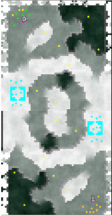

> **ARCHIVED**: This is an archive of an old map / mod from the old Addons site.

### [Map]

> [!IMPORTANT]
> This is an old map format. **Updated versions of maps are available in the Warzone 2100 Maps Database.**

# Winteragony

| | |
| - | - |
| __Author:__ | montetank |
| Addon-type: | __Map__ |
| __Game Version:__ | 3.1.1 |
| Created: | June 1, 2014, 2:56 p.m. |
| Oil: | Medium |
| Players: | 2 |
| Bases: | Normal bases |
| __License:__ | CC-BY-3.0 OR GPL-2.0-or-later |

> File: [2cWinteragony.wz](https://github.com/Warzone2100/old-addons-site/raw/main/assets/275/2cWinteragony.wz)  
> SHA256: 25a91bc847cd802384235303f76921b038372ed8420f3785759bd9907eb6a5f7

## Description:

2-Player map with many chokepoints/passes. 4 oils/base,16/terrain = total 24 oil. 

Have fun

