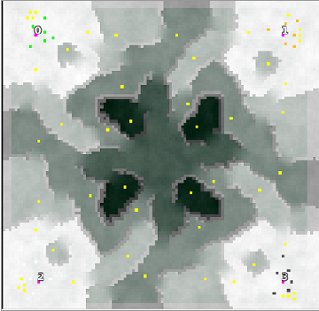

> **ARCHIVED**: This is an archive of an old map / mod from the old Addons site.

### [Map]

> [!IMPORTANT]
> This is an old map format. **Updated versions of maps are available in the Warzone 2100 Maps Database.**

# Quickwinter

| | |
| - | - |
| __Author:__ | montetank |
| Addon-type: | __Map__ |
| __Game Version:__ | 3.1.1 |
| Created: | June 1, 2014, 3:05 p.m. |
| Oil: | Medium |
| Players: | 4 |
| Bases: | Normal bases |
| __License:__ | CC-BY-3.0 OR GPL-2.0-or-later |

> File: [4cQuickwinter.wz](https://github.com/Warzone2100/old-addons-site/raw/main/assets/276/4cQuickwinter.wz)  
> SHA256: d3ad226e8068ea783680a4e9211d779f7630abd9c3626dcaa4b88d39076fa93a

## Description:

A rush is possible- when you can handle quick. No Scavengers- just a map for fun. Try to win under 20 minutes. it is possible. But How?

Have fun-Quickwinter is my favourite map-very strong.

