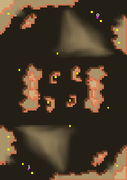

> **ARCHIVED**: This is an archive of an old map / mod from the old Addons site.

### [Map]

> [!IMPORTANT]
> This is an old map format. **Updated versions of maps are available in the Warzone 2100 Maps Database.**

# TwinArrowHeads

| | |
| - | - |
| __Author:__ | bendib |
| Addon-type: | __Map__ |
| __Game Version:__ | 3.1.1 |
| Created: | Nov. 2, 2014, 1:20 p.m. |
| Oil: | Medium |
| Players: | 2 |
| Bases: | No bases |
| __License:__ | CC0-1.0 |

> File: [2cTwinArrowHeads.wz](https://github.com/Warzone2100/old-addons-site/raw/main/assets/282/2cTwinArrowHeads.wz)  
> SHA256: e44d27b54dad4fd5f002ad7f32c04c3382e9d9333731b97320dd6ee3a2307fa2

## Description:

A simple 2-player duel map. At first glance you expect lots of war over the center oils, that doesn't turn out to be the case. Makes for relaxed but rushy games. You generally end up with around 8 oils per player. Bases are protected by a steep hill each. Two oils right in base, two oils right next to base on a little platform.

