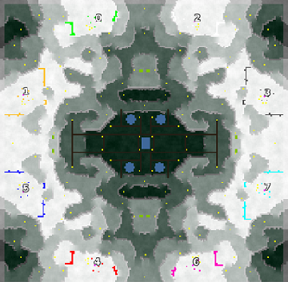

> **ARCHIVED**: This is an archive of an old map / mod from the old Addons site.

### [Map]

> [!IMPORTANT]
> This is an old map format. **Updated versions of maps are available in the Warzone 2100 Maps Database.**

# Forestcity

| | |
| - | - |
| __Author:__ | montetank |
| Addon-type: | __Map__ |
| __Game Version:__ | 3.1.1 |
| Created: | Nov. 20, 2014, 9:18 a.m. |
| Oil: | High |
| Players: | 8 |
| Bases: | Advanced Bases |
| __License:__ | CC-BY-SA-3.0 OR GPL-2.0-or-later |

> File: [8cForestcity.wz](https://github.com/Warzone2100/old-addons-site/raw/main/assets/283/8cForestcity.wz)  
> SHA256: 02f350fe7e952fbf75c7a51a1eba0f50c93aacf51202bc04c1ab3722b3d2db1a

## Description:

Large (220x220) 8-player map with a big city in a forest in the middle of the map. It is also possible to play 2vs2vs2vs2 or 4vs4. 4 oils and 4 trucks/base. 128 oil at the terrain = 20 oil/player. Advanced bases with light defense structures

