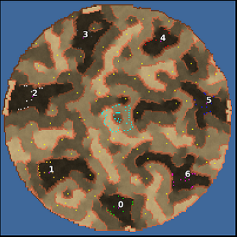

> **ARCHIVED**: This is an archive of an old map / mod from the old Addons site.

### [Map]

> [!IMPORTANT]
> This is an old map format. **Updated versions of maps are available in the Warzone 2100 Maps Database.**

# Thales

| | |
| - | - |
| __Author:__ | montetank |
| Addon-type: | __Map__ |
| __Game Version:__ | 3.1.1 |
| Created: | Dec. 5, 2014, 7:20 p.m. |
| Oil: | Medium |
| Players: | 7 |
| Bases: | Normal bases |
| __License:__ | CC-BY-SA-3.0 OR GPL-2.0-or-later |

> File: [7cThales.wz](https://github.com/Warzone2100/old-addons-site/raw/main/assets/284/7cThales.wz)  
> SHA256: c5f653ae18642250220fb151eef79cf0a5eb88bd49e98c069722227ee734ea0b

## Description:

7-player map with a little scav base in the middle. The bases are in a correct Heptagon. 

The heightmap is not symmetric. Size 160/160. Distance between the bases = 66. 

4 trucks and 6 oils /base. 101 oils/terrain +4/scavs = 21 oil/player.

