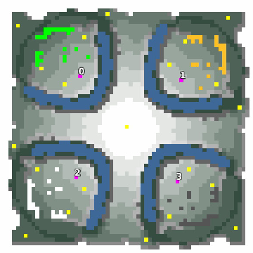

> **ARCHIVED**: This is an archive of an old map / mod from the old Addons site.

### [Map]

> [!IMPORTANT]
> This is an old map format. **Updated versions of maps are available in the Warzone 2100 Maps Database.**

# Mero_LitleMob

| | |
| - | - |
| __Author:__ | Merowingg |
| Addon-type: | __Map__ |
| __Game Version:__ | 3.1.1 |
| Created: | Jan. 4, 2015, 7:07 p.m. |
| Oil: | Low |
| Players: | 4 |
| Bases: | Advanced Bases |
| __License:__ | CC-BY-SA-3.0 OR GPL-2.0-or-later |

> File: [4cMero_LittleMob.wz](https://github.com/Warzone2100/old-addons-site/raw/main/assets/286/4cMero_LittleMob.wz)  
> SHA256: 40f266e342f4f24c86746edafe2fa49958c92da63315dfa78354548307074d78

## Description:

Hello Gentlemen,

The map is called Little Mob, because there is, a little mob.. of the trees on it.

The map is for four players. 65x65 so very small. 5 oils per player, and one extra oil in the very centre. Advanced basic bases included. I shall remain silent about the existence of the gateways soon.

Have fun,

Regards,

Mero

