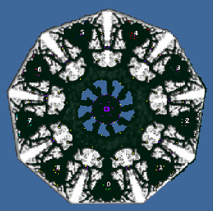

> **ARCHIVED**: This is an archive of an old map / mod from the old Addons site.

### [Map]

> [!IMPORTANT]
> This is an old map format. **Updated versions of maps are available in the Warzone 2100 Maps Database.**

# 9c-BrooksRange

| | |
| - | - |
| __Author:__ | montetank |
| Addon-type: | __Map__ |
| __Game Version:__ | 3.1.2 |
| Created: | Jan. 9, 2015, 8:15 p.m. |
| Oil: | Medium |
| Players: | 9 |
| Bases: | Normal bases |
| __License:__ | CC-BY-3.0 OR GPL-2.0-or-later |

> File: [9cBrooksRange.wz](https://github.com/Warzone2100/old-addons-site/raw/main/assets/287/9cBrooksRange.wz)  
> SHA256: b9744cbf16ef24a787aa5954898c96e8aca02cd59a20b715e53840c81830bf14

## Description:

Symmetrical 9-player map. The angles between the bases are set correctly. A rotation with the desired angle degree (40) has been performed. It is a very large map. So it is with --4oils and 2trucks/base+72 oil/map+4/scavs = 12,44 oil/player—a lowoil map (IMO). Normal bases.

