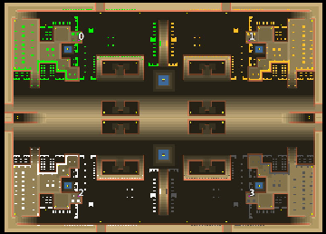

> **ARCHIVED**: This is an archive of an old map / mod from the old Addons site.

### [Map]

> [!IMPORTANT]
> This is an old map format. **Updated versions of maps are available in the Warzone 2100 Maps Database.**

# Mero_TanksWars

| | |
| - | - |
| __Author:__ | Merowingg |
| Addon-type: | __Map__ |
| __Game Version:__ | 3.1.1 |
| Created: | Jan. 11, 2015, 11:45 a.m. |
| Oil: | High |
| Players: | 4 |
| Bases: | Advanced Bases |
| __License:__ | CC-BY-SA-3.0 OR GPL-2.0-or-later |

> File: [4cMero_TanksWars.wz](https://github.com/Warzone2100/old-addons-site/raw/main/assets/288/4cMero_TanksWars.wz)  
> SHA256: 47a102c940c48f1a5876137be3542f17b81d884e37cf6cceb3ce96b537cfbea8

## Description:

Hello Gentlemen,

The map is called Tank Wars, because you start on the map with 108 tanks of various body, turrets, and movement possibilities. There is eight trucks surrounded by 24 half-tracks tanks with also various bodies and turrets. The rest of the tanks awaits well lined on the very big concrete square specially prepared in the base. There are usualy in number of ten of each type. Some stronger units are in number of four and four only, so use them wisely.

What I wanted to achieve is the pure enjoyment of using tanks at the start, but more importantly, I know some of the tanks are used hadly ever, so it is also a new thing to try them, and maybe even vary one's strategic approach. Even sensor and repair turrets are available. I did not provide repair facilities in advanced bases on purpose, each player has already multiple units to take care of them as they wish. To sum up, there is 108 tanks since the start, so a player can still build what he wishes starting his own way.

The map is 250x181 so rather big. Advanced and rich in details bases are available. There is 16 oils per player. It is rather 2v2 map. FFA is possible, but when using advanced bases, some structers will demolish each other at first.

Have fun Gentlemen,

Regards,

Mero

