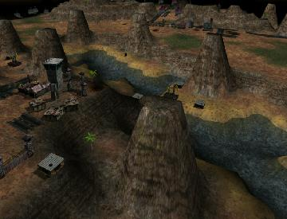

> **ARCHIVED**: This is an archive of an old map / mod from the old Addons site.

### [Mod]

> [!IMPORTANT]
> Mods (or map-mods) **may not work properly or cause crashes / broken behavior** if used with a version of Warzone 2100 other than the one specified below

# Paradise Tileset

| | |
| - | - |
| __Author:__ | NoQ |
| Addon-type: | __Mod__ |
| __Game Version:__ | 3.1.0 [^1] |
| Created: | April 6, 2013, 5:14 a.m. |
| Player Mode: | Skrimish/MP |
| Mod Category: | Graphics |
| __License:__ | CC0-1.0 |

> File: [paradise103.wz](https://github.com/Warzone2100/old-addons-site/raw/main/assets/29/paradise103.wz)  
> SHA256: b63c8f6d7a9beef197791ad2887edbbb9164a15bbae4f095e9269799ead2095c

## Description:

This mod replaces Arizona terrain with some sort of paradise terrain of sunny green grass, beaches palm trees. 

Applicable to skirmish/multiplayer only.

[^1]: This archived mod is only tested with this older version of Warzone 2100, and is unlikely to work with more modern versions as-is.
