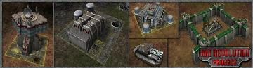

> **ARCHIVED**: This is an archive of an old map / mod from the old Addons site.

### [Mod]

> [!IMPORTANT]
> Mods (or map-mods) **may not work properly or cause crashes / broken behavior** if used with a version of Warzone 2100 other than the one specified below

# Art Revolution mod beta

| | |
| - | - |
| __Author:__ | Jorzi |
| Addon-type: | __Mod__ |
| __Game Version:__ | 3.3.0 [^1] |
| Created: | March 4, 2019, 1:06 a.m. |
| Player Mode: | Both |
| Mod Category: | Graphics |
| __License:__ | CC-BY-SA-3.0 OR GPL-2.0-or-later |

> File: [dummy_file.wz](https://github.com/Warzone2100/old-addons-site/raw/main/assets/292/dummy_file.wz)  
> SHA256: 3ca9ba0b1fd3ff2c73f4886e9ea5dc29ca93c8d512f097d28bc8bb358fc4da8b

## Description:

-----PLEASE NOTE--------

Unfortunately this mod is too large to host in the addons section, please download at:

https://sourceforge.net/projects/artrev2100/files/latest/download

-----PLEASE NOTE--------

The goal of this mod is to recreate all the graphical assets in high detail, using dynamic lighting and normal & specular mapping.

While we may take a few artistic liberties, we try to stay as true to the original style as possible, so you should be able to recognize the tanks & weapons.

[^1]: This archived mod is only tested with this older version of Warzone 2100, and is unlikely to work with more modern versions as-is.
