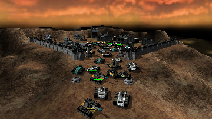

> **ARCHIVED**: This is an archive of an old map / mod from the old Addons site.

### [Mod]

> [!IMPORTANT]
> Mods (or map-mods) **may not work properly or cause crashes / broken behavior** if used with a version of Warzone 2100 other than the one specified below

# YAGeSM - Yet Another Generic Stats Mod v2 (3.2 Release Version)

| | |
| - | - |
| __Author:__ | Black Project |
| Addon-type: | __Mod__ |
| __Game Version:__ | 3.2.0 [^1] |
| Created: | July 23, 2016, 4:39 p.m. |
| Player Mode: | Skrimish/MP |
| Mod Category: | Stats (Balance) |
| __License:__ | CC0-1.0 |

> File: [yagesm_32_v_2.wz](https://github.com/Warzone2100/old-addons-site/raw/main/assets/296/yagesm_32_v_2.wz)  
> SHA256: b6c6b8b34b2aca951ca60c1482a25e75a152dd34154bdadf26d83207c308c461

## Description:

A stats mod compatible for 3.1 and 3.2 releases, designed for one player skirmish and co-op/multiplayer gameplay.

HOW TO INSTALL MODS: http://developer.wz2100.net/wiki/FAQ#HowdoIinstallamod

FEATURES:

Merged all cyborg body/kinetic/thermal point research upgrades with their vehicle variants.

Merged all thermal armor upgrades with kinetic armor/body point upgrades.

Cyborg and Vehicle Transports become available once VTOL Factory is researched.

Lowered enemy AI difficulty from Hide Behind Me and No Place To Hide challenges to easy.

Mortars and Howitzers are now considered cannon class weapons. Reseach upgrades for such weapons were removed, since they're now affected by cannon upgrades.

Hurricane and Whirlwind AA Guns are now considered machine gun class weapons. Reseach upgrades for such weapons were removed, since they're now affected by machine gun upgrades.

Fixed Hide Behind Me challenge allied AI teams being set incorrectly (3.1 release only).

Make sure maximum and minimum elevation to all weapons are set to 90 and -90 respectively.

Added command turret variant for most direct fire weapons. These special weapons have maximum accuracy (100% chance to hit their target) and have their original attack range increased by one tile (128 units). Weapons which have commander turret variant:

Machine Gun

Twin Machine Gun

Heavy Machine Gun

Assault Machine Gun

Twin Assault Gun

Flashlight

Pulse Laser

Heavy Laser

Plasma Cannon

Rocket Pod

Lancer

Tank Killer

Scourge Missile

Flamer

Inferno

Plasmite Flamer

Light Cannon

Medium Cannon

Heavy Cannon

Hyper Velocity Cannon

Assault Cannon

Twin Assault Cannon

Needle Gun

Rail Gun

Gauss Cannon

All weapons (except howitzers, ripple rocket and archangel missile) have their attack range increased by 2 tiles (256 units).

All cyborg weapons attack distance matches their vehicle weapons variant.

Doubled projectile flight speed (except VTOL bombs and indirect fire weapons).

Decreased to zero minimum attack range to all weapons inherited with.

Decreased projectile flight speed to 8 tiles (1024 units) to all indirect fire weapons.

Structure modules, sensor towers, bastions/fortresses, anti-aircraft artillery, artillery batteries and most direct-fire defenses can now be disabled via-structure limits list.

Expanded structure limits list for 3.2 release. Structures added to list:

Oil Derrick (250)

Wall (250)

Gate (250)

Tank Traps (250)

Sensor Tower (250)

Hardened Sensor Tower (250)

VTOL Strike Tower (250)

CB Tower (250)

VTOL CB Tower (250)

Jammer Tower (250)

Sensor Detector Tower (250)

Wide Spectrum Sensor Tower (250)

Hurricane AA Gun Site (250)

Tornado AA Cannon Site (250)

Cyclone AA Cannon Site (250)

Whirlwind AA Gun Site (250)

Sunburst AA Rocket Site (250)

Avenger SAM Site (250)

Vindicator SAM Site (250)

Stormbringer AA Site (250)

Tornado AA Cannon Wall Tower (250)

Cyclone AA Cannon Wall Tower (250)

Hurricane AA Gun Wall Tower (250)

Whirlwind AA Gun Wall Tower (250)

Sunburst AA Rocket Wall Tower (250)

Avenger SAM Wall Tower (250)

Vindicator SAM Wall Tower (250)

Stormbringer AA Laser Wall Tower (250)

Nexus Link Tower (250)

EMP Cannon Wall Tower (250)

Mortar Pit (250)

Bombard Pit (250)

Pepperpot Mortar Pit (250)

Incendiary Mortar Pit (250)

EMP Mortar Pit (250)

Howitzer Battery (250)

Ground Shaker Battery (250)

Hellstorm Battery (250)

Incendiary Howitzer Battery (250)

Rocket Array Battery (250)

Ripple Rocket Battery (250)

Seraph Missile Array Battery (250)

Archangel Missile Battery (250)

Cannon Bastion (250)

Rocket Bastion (250)

Mass Driver Bastion (250)

Missile Bastion (250)

Increased limit to the following structures for 3.2 release:

Power Generator (10 -> 60)

Research Facility (5 -> 250)

Repair Facility (10 -> 250)

VTOL Rearming Pad (50 -> 250)

Added VTOL variant to the following weapons:

Twin Assault Gun

Medium Cannon

Heavy Cannon

Twin Assault Cannon

Plasma Cannon

Gauss Cannon

Hurricane AA Turret

Whirlwind AA Turret

Tornado AA Cannon

Cyclone AA Cannon

Avenger SAM

Vindicator SAM

Stormbringer AA Laser

EMP Cannon

Flamer

Inferno

Plasmite Flamer

Nexus Link Turret

[^1]: This archived mod is only tested with this older version of Warzone 2100, and is unlikely to work with more modern versions as-is.
