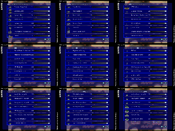

> **ARCHIVED**: This is an archive of an old map / mod from the old Addons site.

### [Mod]

> [!IMPORTANT]
> Mods (or map-mods) **may not work properly or cause crashes / broken behavior** if used with a version of Warzone 2100 other than the one specified below

# BP's Expanded Structure Limits - 3.2 Release

| | |
| - | - |
| __Author:__ | Black Project |
| Addon-type: | __Mod__ |
| __Game Version:__ | 3.2.0 [^1] |
| Created: | July 17, 2016, 6:26 p.m. |
| Player Mode: | Skrimish/MP |
| Mod Category: | Other |
| __License:__ | CC0-1.0 |

> File: [bp_32_limits_mod_v1.wz](https://github.com/Warzone2100/old-addons-site/raw/main/assets/297/bp_32_limits_mod_v1.wz)  
> SHA256: a4e7a1cdc392e6189a2f032051f8b0ec3c30d252c3efcafec70352551cfaf0b0

## Description:

HOW TO INSTALL MODS: http://developer.wz2100.net/wiki/FAQ#HowdoIinstallamod

As it's name suggests, it increases the game's structure limits list by adding 7 pages worth of structures to be limited by your discretion.

In addition to the default core structures present in the game, players can now limit base structure modules, anti-aircraft emplacements, artillery batteries, direct-fire defenses and the massively powerful fortresses.

And lastly, players can now build up to 200 units as opposed to 150 units.

Structures added to the limit list:

Hardcrete Gate

Hardcrete Wall

Power Module

Research Module

Oil Derrick

Tank Traps

AA Flak Cannon Emplacement

Hurricane AA Site

Whirlwind AA Site

Jammer Tower

Incendiary Howitzer Emplacement

Howitzer Emplacement

Ground Shaker Emplacement

Archangel Missile Emplacement

Mini-Rocket Battery

Seraph Missile Battery

EMP Mortar Pit

Incendiary Mortar Pit

Mortar Pit

Bombard Pit

Ripple Rocket Battery

Hellstorm Emplacement

Pepperpot Pit

Machinegun Guard Tower

Stormbringer Emplacement

Avenger SAM Site

Vindicator SAM Site

Sunburst AA Site

CB Tower

Radar Detector Tower

Sensor Tower

Hardened Sensor Tower

Wide Spectrum Sensor Tower

Nexus Link Tower

VTOL CB Tower

VTOL Strike Tower

Assault Gun Hardpoint

Assault Cannon Hardpoint

Scourge Missile Hardpoint

AA Flak Cannon Hardpoint

EMP Cannon Hardpoint

Hyper Velocity Cannon Hardpoint

Tank Killer Hardpoint

Pulse Laser Hardpoint

Whirlwind Hardpoint

Rail Gun Hardpoint

Gauss Cannon Hardpoint

Vindicator Hardpoint

Avenger Hardpoint

Twin Assault Gun Hardpoint

Heavy Machinegun Hardpoint

Light Cannon Hardpoint

Medium Cannon Hardpoint

Heavy Cannon Hardpoint

Lancer Hardpoint

Cannon Fortress

Mass Driver Fortress

Missile Fortress

Heavy Rocket Bastion

Structures not added to the limit list:

Tank Killer Emplacement

Hyper Velocity Cannon Emplacement

Flashlight Emplacement

Heavy Laser Emplacement

Plasma Cannon Emplacement

Rail Gun Emplacement

Gauss Cannon Emplacement

Needle Gun Guard Tower

Scourge Missile Guard Tower

Pulse Laser Guard Tower

Rocket Pod Guard Tower

Lancer Guard Tower

Machinegun Bunker

Assault Gun Bunker

Light Cannon Bunker

Flamer Bunker

Inferno Bunker

Plasmite Flamer Bunker

Twin Assault Cannon Bunker

[^1]: This archived mod is only tested with this older version of Warzone 2100, and is unlikely to work with more modern versions as-is.
