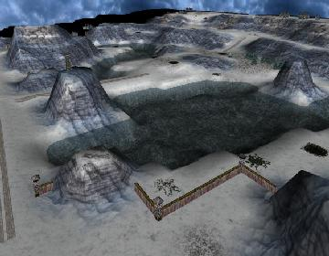

> **ARCHIVED**: This is an archive of an old map / mod from the old Addons site.

### [Mod]

> [!IMPORTANT]
> Mods (or map-mods) **may not work properly or cause crashes / broken behavior** if used with a version of Warzone 2100 other than the one specified below

# Glacier Tileset

| | |
| - | - |
| __Author:__ | NoQ |
| Addon-type: | __Mod__ |
| __Game Version:__ | 3.1.0 [^1] |
| Created: | Nov. 20, 2013, 4:24 a.m. |
| Player Mode: | Both |
| Mod Category: | Graphics |
| __License:__ | CC0-1.0 |

> File: [glacier02.wz](https://github.com/Warzone2100/old-addons-site/raw/main/assets/30/glacier02.wz)  
> SHA256: 595984629babd8dccfdad2c8a0dfeaa4c00d74e780c0a32265dd4b891e79c21e

## Description:

This mod replaces Rocky Mountains terrain with cold arctic terrain of snow and ice. 

Applicable to campaign and skirmish.

v0.2: include snowy structure baseplates by cnceo!

[^1]: This archived mod is only tested with this older version of Warzone 2100, and is unlikely to work with more modern versions as-is.
