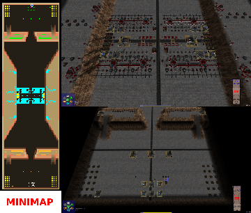

> **ARCHIVED**: This is an archive of an old map / mod from the old Addons site.

### [Map]

> [!IMPORTANT]
> This is an old map format. **Updated versions of maps are available in the Warzone 2100 Maps Database.**

# DO-FortScavWar2p

| | |
| - | - |
| __Author:__ | Doruletz |
| Addon-type: | __Map__ |
| __Game Version:__ | 3.1.5 |
| Created: | Jan. 16, 2017, 12:10 a.m. |
| Oil: | Extreme |
| Players: | 2 |
| Bases: | Advanced Bases |
| __License:__ | CC0-1.0 |

> File: [2cDOFortScavWar2p.wz](https://github.com/Warzone2100/old-addons-site/raw/main/assets/300/2cDOFortScavWar2p.wz)  
> SHA256: 3b7ddfb5504461bee1e97cfeaf41761914e4ae95452a9b42bbe588f2bbcfd960

## Description:

> There's only 2 things I hate about playing Warzone 2100, early rushes and V-TOLS...

> I mean why end the game with Twin MG + Flamers, or Medium Cannon and MRL Rockets and maybe Lancers at best? All on wheels or Half-track Viper or Cobra bodies...

> I like to have the time and opportunity to work my way up the food chain, so to speak.

I love being able to enjoy all the bells and whistles of the "late game" weaponry, such as Pulse Laser, Rail Gun, Scourge & Seraph Missiles, etc.

> I specifically designed this map, in an attempt to be able to achieve that, by putting a super-strong Scavenger Fortress between players, and no way around it, by ground or air... 

> I mean those Scavengers have everything, including Vindicator SAMs, Incendiary Howitzers and even Cannon and Missile Fortresses... 

> No way you can overcome all that without at least Python Tracks Bodies with Heavy Cannon, Twin Assault Cannon and/or Gun and Lancers, all with medium to best possible upgrades researched.

You will also need most of the Synaptic Link updates and Composite Materials (both Kinetic and Thermal) already researched to make your units strong enough to eradicate the Scavenger Base that stands between you and your actual opponent.

> Once you're past the scavs, the entrance to your opponent's base is funnel shaped, ending in a 5-6 tiles wide passage, with a maximum height cliff and plateau on both sides, so even more fun is on the way...

> The map is 60 wide x 192 long, with 36 oils per player in base, plus another 16 (8 per) from the Scavs.

> Tested and working fine in v3.1.5, v3.2.1 and v3.2.2.

> P.S. - I strongly believe that everybody should design their bases according to their own strategy and desire, so what I made available from the get-go is a fairly strong AA defense (to take care of the "I hate V-TOLS" part, at least for a while) and 10 Incendiary Howitzers per player.

> Another thing I don't really like is having the Tank Factories facing the wrong way, so I decided to include all 5 Tank Factories in the startup line, and I positioned them facing the right way. You also get just one Research Facility and 4 power generators. All of them are entry level, with NO MODULES. Last, there's a Command Relay Center. 

> Yes, I know that Commanders and Battle Groups are not all that popular in Multiplay online games, but I like using them against AI in Skirmish game sometimes...

> That's it, as far as Base Buildings go.

FINAL NOTE: I already made a 3 player version, which I will also post here, and I will have a 4 player version ready soon.

The 3 player map is for 1 vs 2 only, as two of the bases are side by side, making any attempt at FFA (1 vs 1 vs 1) both unfair as well as futile.

You're welcome to PM me with comments and suggestions, to let me know what you think, especially since this is my very first map... 

Enjoy!

