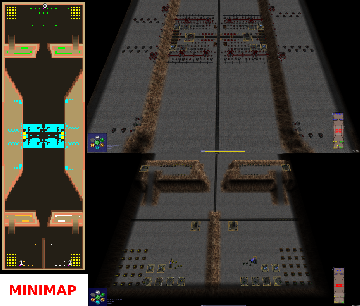

> **ARCHIVED**: This is an archive of an old map / mod from the old Addons site.

### [Map]

> [!IMPORTANT]
> This is an old map format. **Updated versions of maps are available in the Warzone 2100 Maps Database.**

# DO-FortScavWar3p

| | |
| - | - |
| __Author:__ | Doruletz |
| Addon-type: | __Map__ |
| __Game Version:__ | 3.1.5 |
| Created: | Jan. 16, 2017, 1:35 p.m. |
| Oil: | Extreme |
| Players: | 3 |
| Bases: | Advanced Bases |
| __License:__ | CC0-1.0 |

> File: [3cDOFortScavWar3p.wz](https://github.com/Warzone2100/old-addons-site/raw/main/assets/301/3cDOFortScavWar3p.wz)  
> SHA256: 10a7ff3a73f06e22534d8729470b293fc11b12eeba88ad79abc829e3564e61d6

## Description:

This is the 3 player version of the map, as promised.

Only good for a 2 vs 1, due to the way bases are located on the map.

Basically, what I did is split one of the bases in two, creating 2 neighbors / allies sharing real estate on the map.

To keep things somewhat balanced, the "lonely wolf player" has more or less double the amount of everything.

So, Player "0" gets 40 oils in base, 5 Factories, 5 Research Facilities and 4 Power Generators, while the team of Player "1" and "2" only get 20 oils in base each, 2 Factories, 2 Research Facilities and 2 Power Generators each.

Everything else is the same, including the Scavenger Fortress in the middle, with their 16 oils.

I almost forgot, I also put 10 extra Incendiary Howitzers in the Scavenger Fortress, behind the wall facing the 2 player team side.

The map size is still 60 wide by 192 long, same as the 2 player version.

Also tested, and working fine in v3.1.5, v3.2.1 and v3.2.2

For a more detailed description and storyline, please see the original 2 player version, which I already uploaded here earlier.

Enjoy.

P.S. - As mentioned before, in the original 2 player map description, please shoot me a PM to let me know what you think. Comments and suggestions are always welcome.

