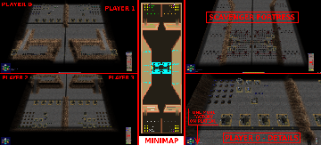

> **ARCHIVED**: This is an archive of an old map / mod from the old Addons site.

### [Map]

> [!IMPORTANT]
> This is an old map format. **Updated versions of maps are available in the Warzone 2100 Maps Database.**

# DO-FortScavWar4p

| | |
| - | - |
| __Author:__ | Doruletz |
| Addon-type: | __Map__ |
| __Game Version:__ | 3.1.5 |
| Created: | Jan. 16, 2017, 4:48 p.m. |
| Oil: | High |
| Players: | 4 |
| Bases: | Advanced Bases |
| __License:__ | CC0-1.0 |

> File: [4cDOFortScavWar4p.wz](https://github.com/Warzone2100/old-addons-site/raw/main/assets/302/4cDOFortScavWar4p.wz)  
> SHA256: ff035c13bb0a88987859c497e6a6a55ea14b162eab2201b77d2ccd5bb2e07a88

## Description:

And finally, this is the 4 player version of the map.

The map size is still 60 wide by 192 long, same as the initial 2 player version, which I consider being enough for a 4 players map, but no more.

So, unless I ever decide to take the time to start again from scratch on a bigger size map, there's not gonna be any 6, 8 or 10 player version of this map.

Basically, what I did is I took the original 2 players map and divided both bases in half, in order to end up with 4 of them.

Then I started to rearange stuff..

Due to space limitations (I hate overcrowded maps), each player now only has 20 oils in base, but there's also the 16 oils from Scavengers, which will add another 4 for each player if need be...

Base defenses were also spilt in half, with each player getting his half of what the original 2 player map lineup used to be.

For startup base buildings, I decided to give each player all 5 Factories, plus 2 Power generators and 2 Research Facilities.

The reason for puting all 5 Factories on the map was explained in the previous 3 player version. Basically I just like to have all Factories facing the right way, so object rotation is necessary...

Note that none of the above mentioned base structures have the corresponding MODULES applied from the get go, I'll leave that task to each player.

And of course, there's the much debated Command Relay Center, which is almost never of any use in online multiplayer games, but might come in handy for Skirmish games against AI.

Like for example, I sometimes use Commanders and Battle Groups against AI to "pick a fight", or just harrass them a little.

Everything else is the same, including the Scavenger Fortress in the middle, with their 16 oils.

I almost forgot, I also put 10 extra Incendiary Howitzers in the Scavenger Fortress, behind each wall facing the respective 2 player team side, so a total of 20 extra Incendiary Howitzers have been added to the Scavenger Fortress arsenal.

As with the previous 2 and 3 player versions, this map has also been tested, and is working fine in v3.1.5, v3.2.1 and v3.2.2

For a more detailed description and storyline, please see the original 2 player version, which I uploaded first.

Enjoy.

P.S. - As mentioned before, in the original 2 player map description, please shoot me a PM to let me know what you think. Comments and suggestions are always appreciated.

