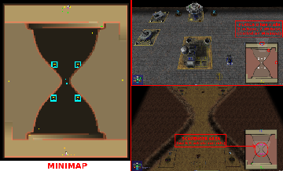

> **ARCHIVED**: This is an archive of an old map / mod from the old Addons site.

### [Map]

> [!IMPORTANT]
> This is an old map format. **Updated versions of maps are available in the Warzone 2100 Maps Database.**

# Hourglass-LowOil

| | |
| - | - |
| __Author:__ | Doruletz |
| Addon-type: | __Map__ |
| __Game Version:__ | 3.1.5 |
| Created: | Sept. 30, 2017, 10:34 p.m. |
| Oil: | Low |
| Players: | 2 |
| Bases: | Normal bases |
| __License:__ | CC0-1.0 |

> File: [2cHourglassLowOil.wz](https://github.com/Warzone2100/old-addons-site/raw/main/assets/303/2cHourglassLowOil.wz)  
> SHA256: 74485e166955e114e0517755bf9a92f8639db9d6a5c24dc80b147a2969af89ae

## Description:

The map design was originally created by user "jman5000now", and posted as an attachment in this thread, for everyone to download, which is just what I did:



I liked the design a lot, but unfortunately "jman5000now" left the map unfinished, namely there were no oil resources at all on the entire map surface. 

While technically ZERO OIL can be considered as LOW OIL, the map was useless, as you cannot play a game with just the 1,300 or 2,500 startup power points.

So, I went ahead and added the oils on the map, as well as the Scavenger units and structures, keeping in mind that "jman5000now" intended this to be a low oil map, and what you see here is the final result...

NOTE: As you can see, I did listed "jman5000now" as co-author of this map, since the whole map landscape and concept was his design.

> Each player gets to start the game with only 1 single Truck and 4 oils, out of which 2 oils are in his/her base and another 2 off base, with an additional 8 oils being initially assigned to the Scavenger faction.

So, there's a total of 16 oils on this map now, which amounts to an average of 8 oils per player, thus qualifying it as a low oil map.

Map size is 117 wide by 144 long, so there's plenty of space to wander around and look for a fight, or hide away from one...

> I listed this map as "NORMAL BASES", since there are no actual base defense structures to make it qualify as an "ADVANCED BASES" map, except for the fact that I placed a MG Bunker and a Scourge Missile Tower at the very top of each base access ramp.

I only did this in order to keep the Scavengers out in the early stages of the game.

Besides the required Command Center, the home bases include one Factory, one Research Facility and one Power Generator for each player.

Note that NO MODULES are applied to either of them. Also, NO Oil Derricks are provided, just the oil wells, that's it.

This map has been tested, and is working fine in v3.1.5, v3.2.1 and v3.2.2

My thanks to Forum user "jman5000now" for his original design of this map.

Enjoy.

