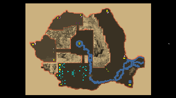

> **ARCHIVED**: This is an archive of an old map / mod from the old Addons site.

### [Map]

> [!IMPORTANT]
> This is an old map format. **Updated versions of maps are available in the Warzone 2100 Maps Database.**

# DO-Romania

| | |
| - | - |
| __Author:__ | Doruletz |
| Addon-type: | __Map__ |
| __Game Version:__ | 3.1.5 |
| Created: | March 13, 2017, 10:58 a.m. |
| Oil: | Medium |
| Players: | 6 |
| Bases: | No bases |
| __License:__ | CC0-1.0 |

> File: [6cDORomania.wz](https://github.com/Warzone2100/old-addons-site/raw/main/assets/304/6cDORomania.wz)  
> SHA256: 162a3b95ea8ac34d65aec326a346fd165c9243d0c9d98dd70bbcc2af3f35f73a

## Description:

Ever wondered what it will be to be able to fly over the Carpathian Mountains in a VTOL??

Or to drive a Scourge Missile Tiger Hover across the Danube River??

Well, I just made this possible for you guys...

I used a real topographic map of Romania, with some modifications to allow for base locations and access roads across the mountains and rivers.

This is a 6 player map, intended for a 2 vs 4, since the bases are paired in twos, and almost next to each other.

Players 0 and 1 have double the oil and double the startup trucks, to even things out a little.

Like I said before, I believe everyone should design and build their own base defenses and structures, so, besides to obvious Command Center, I just put a couple MG Bunkers for each player to stave off the initial Scavenger invasion (especially if you are playing an UltScav MOD, like I do.).

The map is huge, 230x170, so there's plenty of space to wonder around looking for a fight (or hide away from one).

 I lived in the USA for over 22 years now, but Romania is my native country, and its map is very familiar to me, thus making it easier to locate units and features on the map. That was one of the reasons I decided to create this map to start with...

The 2 player team (players 0 and 1) each get 8 oil in base and an extra 4 off base, and also 4 trucks each.

The other 4 players only get half of that, so in fact both teams have the exact same startup numbers.

There are 16 more oils to be had from the Scavengers.

Since I very much hate early rushes in game, I gave the Scavs lots of goodies, such as Incendiary Howitzers and Mortars, Scourge Missile Hardpoints, etc.

Scavs start with no units, but the 4 plants I gave them will start spawning some very fast...

Enjoy, and let me know what you think about this map.

