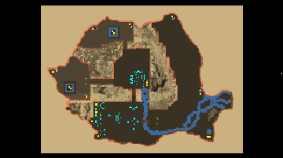

> **ARCHIVED**: This is an archive of an old map / mod from the old Addons site.

### [Map]

> [!IMPORTANT]
> This is an old map format. **Updated versions of maps are available in the Warzone 2100 Maps Database.**

# DO-Romania-2v2v2

| | |
| - | - |
| __Author:__ | Doruletz |
| Addon-type: | __Map__ |
| __Game Version:__ | 3.1.5 |
| Created: | March 14, 2017, 11:07 a.m. |
| Oil: | Medium |
| Players: | 6 |
| Bases: | No bases |
| __License:__ | CC0-1.0 |

> File: [6cDORomania2v2v2.wz](https://github.com/Warzone2100/old-addons-site/raw/main/assets/305/6cDORomania2v2v2.wz)  
> SHA256: 35cc2898f22055d8d82570582b1e9b86f2d76af9618657d527d33d4695bacbe0

## Description:

THIS IS A MORE BALANCED VERSION, SUITED FOR A 2 VS 2 VS 2 GAME.

Other than that, everything stays pretty much the same as in the previous 2 vs 4 version.

Ever wondered what it will be to be able to fly over the Carpathian Mountains in a VTOL?? Or to drive a Scourge Missile Tiger Hover across the Danube River?? 

Well, I just made this possible for you guys... 

I used a real topographic map of Romania, with some modifications to allow for base locations and access roads across the mountains and rivers. 

This is a 6 player map, intended for a 2 vs 2 vs 2, since the bases are paired in twos.

Starts with 3 trucks and 4 oils per player in base, with another 4 off base and accessible by Hover Truck only.

There are 24 more oils on the map, held by the Scavengers, which when taken, gives every player another 4 oils on average.

This brings the grand total to a 12 oils per player average, thus the map falls in the medium oil category, as defined here...

Like I said before, I believe everyone should design and build their own base defenses and structures, so, besides the obvious Command Center, I just put a couple MG Bunkers for each player, located strategically, and meant to stave off any initial Scavenger invasion (especially if you are playing an UltScav MOD, like I do.). 

The map is huge, 230x170, so there's plenty of space to wonder around looking for a fight (or hide away from one). 

I lived in the USA for over 22 years now, but Romania is my native country, and its map is very familiar to me, thus making it easier to locate units and features on the map. That was one of the main reasons why I decided to create this map to start with... 

Since I very much hate early rushes in the game, I gave the Scavs lots of goodies, such as Incendiary Howitzers and Mortars, Ripple Rockets, Scourge Missile Hardpoints, etc. 

The Scavs start with no units, but the 4 plants I gave them will start spawning some very fast, especially in an UltScav MOD... 

Enjoy, and let me know what you think about this map.

