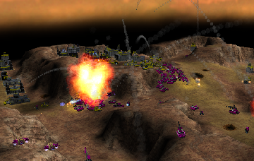

> **ARCHIVED**: This is an archive of an old map / mod from the old Addons site.

### [Mod]

> [!IMPORTANT]
> Mods (or map-mods) **may not work properly or cause crashes / broken behavior** if used with a version of Warzone 2100 other than the one specified below

# Cobra AI

| | |
| - | - |
| __Author:__ | Berserk Cyborg |
| Addon-type: | __Mod__ |
| __Game Version:__ | 3.2.3 [^1] |
| Created: | May 15, 2017, 11:52 p.m. |
| Player Mode: | Skrimish/MP |
| Mod Category: | AI |
| __License:__ | CC0-1.0 |

> File: [Cobra.wz](https://github.com/Warzone2100/old-addons-site/raw/main/assets/306/Cobra.wz)  
> SHA256: 073da6c2a263929e3cc0ab345863bb713c574f941cd42a410f169ed212411d61

## Description:

Cobra is a skirmish AI I made to change based on the map (supports hover maps), starting technology, base level, and a somewhat adaptive research order.

It has five personalities that prefer different types of weapons which are dynamically chosen depending on the map starting technology or base level. 

Includes many chat commands that can range from changing the personality, issue orders, or even telling it to only use hover propulsion.

Offers extra challenges if on Hard and especially Insane difficulty (may need to change your play style).

This AI uses a modified variant of NoQ's Nullbot standard for access to weapon/research definitions.

For more information visit the Git repository below

https://github.com/KJeff01/Cobra-AI

chat commands include: need power/truck/tank/cyborg/vtol. attackX -- (X being a player number). oilX -- to specifically attack nearby enemy oil. help me!/help me!! for calling for Cobra units to go to your hq (for compatibility with Nexus AI). AC/AR/AB/AM/AL -- make it switch personalities. FFA -- after a team skirmish is won, break alliance and fight it. toggle mg -- disable/enable machinegun use. toggle cyborg -- disable/enable cyborg use. toggle hover -- disable/enable force Cobra to use hover propulsion.

[^1]: This archived mod is only tested with this older version of Warzone 2100, and is unlikely to work with more modern versions as-is.
