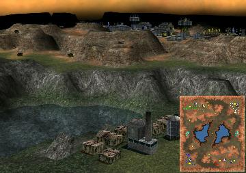

> **ARCHIVED**: This is an archive of an old map / mod from the old Addons site.

### [Map-Mod]

> [!IMPORTANT]
> Mods (or map-mods) **may not work properly or cause crashes / broken behavior** if used with a version of Warzone 2100 other than the one specified below

# Mirage

| | |
| - | - |
| __Author:__ | NoQ |
| Addon-type: | __Map-Mod__ |
| __Game Version:__ | 3.1.0 [^1] |
| Created: | March 22, 2013, 8:53 p.m. |
| Oil: | Low |
| Players: | 6 |
| Bases: | Advanced Bases |
| Player Mode: | Skrimish/MP |
| Mod Category: | Graphics |
| __License:__ | CC0-1.0 |

> File: [6cMirage102.wz](https://github.com/Warzone2100/old-addons-site/raw/main/assets/31/6cMirage102.wz)  
> SHA256: 414b0c6da0b8a152fd2fbd6b29f441e5fe99f9185cb9bee780dee7ebd20f5bf7

## Description:

A 3x3 team duel map with custom textures similar to the paradise tileset mod, but with a little more extra eye candy to notice.

Each team consists of a fortress for two players with 4 oils each and a standalone highground position for a single player with 6 oils.

[^1]: This archived mod is only tested with this older version of Warzone 2100, and is unlikely to work with more modern versions as-is.
