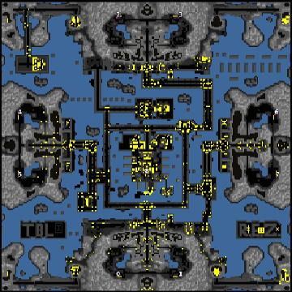

> **ARCHIVED**: This is an archive of an old map / mod from the old Addons site.

### [Map]

> [!IMPORTANT]
> This is an old map format. **Updated versions of maps are available in the Warzone 2100 Maps Database.**

# The Battlelands (TBL) V2.0

| | |
| - | - |
| __Author:__ | REZ |
| Addon-type: | __Map__ |
| __Game Version:__ | 3.1.5 |
| Created: | Sept. 26, 2017, 9:34 p.m. |
| Oil: | Medium |
| Players: | 8 |
| Bases: | No bases |
| __License:__ | CC-BY-SA-3.0 OR GPL-2.0-or-later |

> File: [8cTBL2_61_29.wz](https://github.com/Warzone2100/old-addons-site/raw/main/assets/312/8cTBL2_61_29.wz)  
> SHA256: 5dffef311b1827c2bf35a9b4dd66083931a2ba5d27064612d14e03dd546a5a4c

## Description:

TBL V2.0 (8c-TBL2_61)

This is a map, that I did create Years ago to make long distance battles happen and also instant action fights.

Scavengers are also supported.

Enjoy and survive!

R.E.Z.

