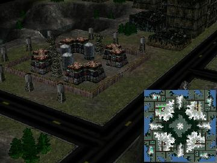

> **ARCHIVED**: This is an archive of an old map / mod from the old Addons site.

### [Map-Mod]

> [!IMPORTANT]
> Mods (or map-mods) **may not work properly or cause crashes / broken behavior** if used with a version of Warzone 2100 other than the one specified below

# Inversion

| | |
| - | - |
| __Author:__ | NoQ |
| Addon-type: | __Map-Mod__ |
| __Game Version:__ | 3.1.0 [^1] |
| Created: | April 1, 2013, 5:01 a.m. |
| Oil: | Medium |
| Players: | 4 |
| Bases: | Advanced Bases |
| Player Mode: | Skrimish/MP |
| Mod Category: | Graphics |
| __License:__ | CC0-1.0 |

> File: [4cInversion.wz](https://github.com/Warzone2100/old-addons-site/raw/main/assets/32/4cInversion.wz)  
> SHA256: 3ac54f27d7a52560916f11b56b42b9c6d8de3a404e1efb6d3bb644a0f39e6e6f

## Description:

A 4-player map with customized road textures.

The map is a large free-for-all. Even though the middle hill doesn't have any oil, the oils around it are bound to be an object of interest, and it seems impossible to protect them with a single army; thus army placement needs to be considered carefully on this map.

[^1]: This archived mod is only tested with this older version of Warzone 2100, and is unlikely to work with more modern versions as-is.
