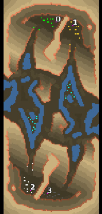

> **ARCHIVED**: This is an archive of an old map / mod from the old Addons site.

### [Map]

> [!IMPORTANT]
> This is an old map format. **Updated versions of maps are available in the Warzone 2100 Maps Database.**

# Mero_Eve1984

| | |
| - | - |
| __Author:__ | Merowingg |
| Addon-type: | __Map__ |
| __Game Version:__ | 3.1.0 |
| Created: | March 26, 2013, 3:06 a.m. |
| Oil: | Medium |
| Players: | 4 |
| Bases: | Normal bases |
| __License:__ | CC-BY-SA-3.0 OR GPL-2.0-or-later |

> File: [4cMero_Eve1984.wz](https://github.com/Warzone2100/old-addons-site/raw/main/assets/38/4cMero_Eve1984.wz)  
> SHA256: 19001cb32ba16788498fc4c20de7e1b60379cb9a07d76af3e33a053bebf199ae

## Description:

Hello Gentlemen  

The map Eve1984 is called because of two reasons. First, official one, I have never used a name, or a number except of versions.

Second, more important, but fictional. Eve1984 is the name of one of the first robots created in one of the normally looking factories in the centre of the map. But it all had changed since that way. Yes gentlemen she went cruel, and it is said that after "she" escaped, she is preparing robot forces according to improved plans she has copied just before she had escaped. 

The map is 200x90, yay I broke pattern  for four players. There is 13 oils per player. Two of which are being kept by the Scavengers. And two are on islands. Advanced bases are included, but with extremely basic defences, and only in most obvious places. There is no repair facility. It is recommended to be 2v2. FFA is possible, but then, our neighbours can have quite a nightmare.

It is advisable to visit all the places. On this map a small mistake may cost you loosing as few paths are really dirty and sneaky when reached. It is also advisable to help each other, as on purpose one of our pair, has better oil reach, but at the same time it has addictional path to make him more vulnerable.

Have fun Gentlemen  

I do hope you will like it.

Mero, RekamPam

