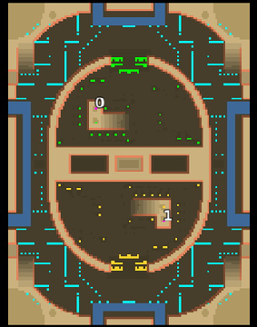

> **ARCHIVED**: This is an archive of an old map / mod from the old Addons site.

### [Map]

> [!IMPORTANT]
> This is an old map format. **Updated versions of maps are available in the Warzone 2100 Maps Database.**

# Mero_WarPill

| | |
| - | - |
| __Author:__ | Merowingg |
| Addon-type: | __Map__ |
| __Game Version:__ | 3.1.0 |
| Created: | March 26, 2013, 3:06 a.m. |
| Oil: | High |
| Players: | 2 |
| Bases: | Advanced Bases |
| __License:__ | CC-BY-SA-3.0 OR GPL-2.0-or-later |

> File: [2cMero_WarPill.wz](https://github.com/Warzone2100/old-addons-site/raw/main/assets/42/2cMero_WarPill.wz)  
> SHA256: 0e53833bc61a778881388130c5e959f0896acd70f918607a9a059f1afe5713dc

## Description:

Hello Gentlemen  

After a long break I have finally made 1v1 map.

It is called War Pill, because the bases of the players joined look like a pill. And there will be war  if not only between players, then also with the Scavengers.

The map is 120x160, for two players. Advanced bases with basic defence and gateways are included. It is 17 oils per player. 7 oils in base, and another 10 protected by the Scavengers if you turn them on. Be advised to beware of their mighty presence here. Visiting some mysterious places is always advisable  

The map has nice buildings layout and terrain painting. The water ditches are designed to protect heavy turtling.

Have fun Gentlemen  

Backup and support, clear thoughts always welcome  It is one of my shortest names created from two words  

