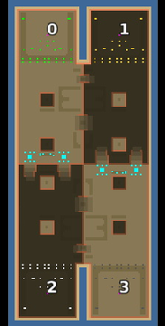

> **ARCHIVED**: This is an archive of an old map / mod from the old Addons site.

### [Map]

> [!IMPORTANT]
> This is an old map format. **Updated versions of maps are available in the Warzone 2100 Maps Database.**

# Mero_Negative

| | |
| - | - |
| __Author:__ | Merowingg |
| Addon-type: | __Map__ |
| __Game Version:__ | 3.1.0 |
| Created: | March 26, 2013, 3:06 a.m. |
| Oil: | High |
| Players: | 4 |
| Bases: | Advanced Bases |
| __License:__ | CC-BY-SA-3.0 OR GPL-2.0-or-later |

> File: [4cMero_Negative.wz](https://github.com/Warzone2100/old-addons-site/raw/main/assets/48/4cMero_Negative.wz)  
> SHA256: 4b37ee65c91ff13db258ecf2fc2dd99c654c1e6f18da1931bd8df09cdf8d5e3f

## Description:

Hello Gentlemen  

The Negative map, is called as it is called  because each side of the map is a sort of negative of the other. The players at each side of the map are placed at two different terrain levels. One much higher, and the other much lover. 

Such usage of terrain may be used wisely when advanced and beginning players are to struggle on the map. Also it is a negative in the base and oil placement terms. This time almost all oil is placed in from of your base so protect is wisely. You have one oil derrick at the back of each base, so when in serious trouble, use it even more wisely. Even water is at the most unexpected place this time  

The map is 101x220, for four players. Scavengers are included. The map is 15 oils per player, and additional two per player available only by VTOL Transport. Advanced bases and gateways are included. Basic base protection.

Have fun  

