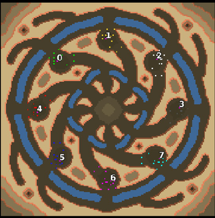

> **ARCHIVED**: This is an archive of an old map / mod from the old Addons site.

### [Map]

> [!IMPORTANT]
> This is an old map format. **Updated versions of maps are available in the Warzone 2100 Maps Database.**

# Mero_Hypnosis

| | |
| - | - |
| __Author:__ | Merowingg |
| Addon-type: | __Map__ |
| __Game Version:__ | 3.1.0 |
| Created: | March 26, 2013, 3:06 a.m. |
| Oil: | Medium |
| Players: | 8 |
| Bases: | Advanced Bases |
| __License:__ | CC-BY-SA-3.0 OR GPL-2.0-or-later |

> File: [8cMero_Hypnosis.wz](https://github.com/Warzone2100/old-addons-site/raw/main/assets/49/8cMero_Hypnosis.wz)  
> SHA256: 1dba28acc64590aa48786ac97edd9a7b622ccf4582b97005eaac380b3eb33c2c

## Description:

Hello Gentlemen  

Hypnosis owns its name due to the fact that it reminds me of this spinning device used sometimes for hypnosis  

The map is for eight players. 14 oils per player, but two of those oils are available only by VTOL Transport, so it will be mainly 12 per player I assume  

Advanced very basic bases are included with a little defence system. Gateways are included. The map is 180x180

The map can be unpredictable sometimes as the enemy forces can appear from both sides of each base. Also hovers add some advantage.

Have fun gentlemen  

