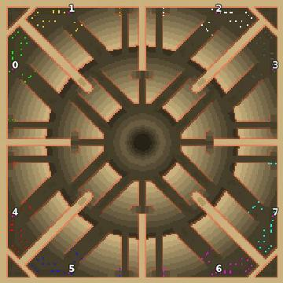

> **ARCHIVED**: This is an archive of an old map / mod from the old Addons site.

### [Map]

> [!IMPORTANT]
> This is an old map format. **Updated versions of maps are available in the Warzone 2100 Maps Database.**

# Mero_BlackNuke

| | |
| - | - |
| __Author:__ | Merowingg |
| Addon-type: | __Map__ |
| __Game Version:__ | 3.1.0 |
| Created: | March 26, 2013, 3:06 a.m. |
| Oil: | Medium |
| Players: | 8 |
| Bases: | Advanced Bases |
| __License:__ | CC-BY-SA-3.0 OR GPL-2.0-or-later |

> File: [8cMero_BlackNuke.wz](https://github.com/Warzone2100/old-addons-site/raw/main/assets/51/8cMero_BlackNuke.wz)  
> SHA256: 5a97eed9ba3f1d2b2ee325d50028d7bee9e335a8072ca5bb6935ba07cf4f56cc

## Description:

Hello Gentlemen  

I am happy to present the Black Nuke map. It is called Black Nuke after the big black nuclear bomb which left two very big and very deep circular canyons due to its special features and terrain complexity. People call it also Black Nuke because of its characteristic look on the previews.

The map is for eight players. It is 200x200, 14 oils per player, but one of those oils is accessible only via VTOL transport. You can chose between one of those exposed in the centre or hidden. Advanced bases and gateways are included. Basic defence structures. You have four oils in base. It is very good for FAA, or any other combination.

Beware of the enormous radiation near the centre of the explosion. Have fun  

