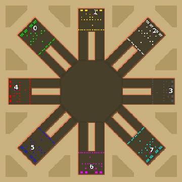

> **ARCHIVED**: This is an archive of an old map / mod from the old Addons site.

### [Map]

> [!IMPORTANT]
> This is an old map format. **Updated versions of maps are available in the Warzone 2100 Maps Database.**

# Mero_MoonlitSQR

| | |
| - | - |
| __Author:__ | Merowingg |
| Addon-type: | __Map__ |
| __Game Version:__ | 3.1.0 |
| Created: | March 26, 2013, 3:06 a.m. |
| Oil: | Extreme |
| Players: | 8 |
| Bases: | Advanced Bases |
| __License:__ | CC-BY-SA-3.0 OR GPL-2.0-or-later |

> File: [8cMero_MoonlitSQR.wz](https://github.com/Warzone2100/old-addons-site/raw/main/assets/52/8cMero_MoonlitSQR.wz)  
> SHA256: 3bf5cd6886e02dfd04f8a240f28446de7f98ca2c33e6b688c938cf526d9e0647

## Description:

Hello Gentlemen  

A modest come back  Moonlit Squared is simply modified Sunny Squared, I wanted to make separate map with two ways to a base, but finally looking at my draws I decided to modify the previous map.

The map is for eight players, twenty four oils per player in base and another three per player on the cliffs. Advanced bases with the simplest defences and gateways are included.

Enjoy more safe base ways  

