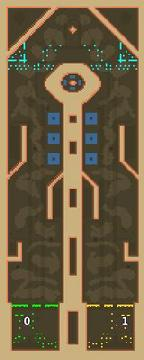

> **ARCHIVED**: This is an archive of an old map / mod from the old Addons site.

### [Map]

> [!IMPORTANT]
> This is an old map format. **Updated versions of maps are available in the Warzone 2100 Maps Database.**

# Mero_Cyclops

| | |
| - | - |
| __Author:__ | Merowingg |
| Addon-type: | __Map__ |
| __Game Version:__ | 3.1.0 |
| Created: | March 26, 2013, 3:06 a.m. |
| Oil: | Medium |
| Players: | 2 |
| Bases: | Advanced Bases |
| __License:__ | CC-BY-SA-3.0 OR GPL-2.0-or-later |

> File: [2cMero_Cyclops.wz](https://github.com/Warzone2100/old-addons-site/raw/main/assets/54/2cMero_Cyclops.wz)  
> SHA256: 93b33b46627eecabd64c7ed71f3d38a50b35ebf634ce2e6c00a89c13ec795524

## Description:

Hello Gentlemen  

I am very happy to introduce a 1v1 map. I know I know I have neglected this target mapmaking area but I did my best to win you back  

The map is called Cyclops because ov very obvious reason, a clever eye will see the eye of the Cyclops in a short notice. The Cyclops divided the two players into equal halves, the exact middle is above his eye so he can see closely the warfare events.

Cyclops is a clever creature, if needed he can call scavengers who protect his eye with dense structures and reasonable units amount.

The map is 100x250, the 250 makes it very very long, the way back make it even longer! Be wise to maintain the whole path or you may end badly with enemies at yours base gates. As mentioned, scavengers are included, also advanced bases and gateways.

The map is 15 oils per player, 4 in base, 1 in area accesible only by plane, 1 well defended by Scavengers and one a little bit less. The rest is here there and everywhere. You know me, so it is wise to visit all unexpected places. I mean all.

The division between the bases is thicker to make it harder for those who like long range tricks.

Have fun Gentlemen  

I would like to hear someone from time to time here which would be nice..  

Regards

Mero RekamPam <<

