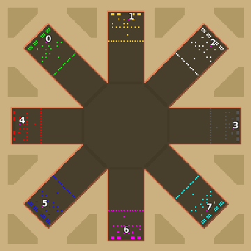

> **ARCHIVED**: This is an archive of an old map / mod from the old Addons site.

### [Map]

> [!IMPORTANT]
> This is an old map format. **Updated versions of maps are available in the Warzone 2100 Maps Database.**

# Mero_SunnySQR

| | |
| - | - |
| __Author:__ | Merowingg |
| Addon-type: | __Map__ |
| __Game Version:__ | 3.1.0 |
| Created: | March 26, 2013, 3:06 a.m. |
| Oil: | High |
| Players: | 8 |
| Bases: | Advanced Bases |
| __License:__ | CC-BY-SA-3.0 OR GPL-2.0-or-later |

> File: [8cMero_SunnySQR.wz](https://github.com/Warzone2100/old-addons-site/raw/main/assets/56/8cMero_SunnySQR.wz)  
> SHA256: 72d46d5edb349bedf230ccae531ffbe3f8afbe552d510c7c587d3297c9b23d1d

## Description:

Hello Gentlemen  

I assume I am heading this squared fascination again  

The map is called Sunny, because it reminds me of the sun, and for sure it is sunny on this Squared  

The map is for eight players, twenty four oils per player in base and another three per player on the cliffs. Advanced bases with the simplest defences and gateways are included.

I wanted something like Squared but simplified.. and here it is.

Have fun and don't get burned.

