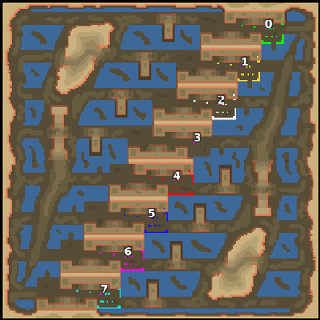

> **ARCHIVED**: This is an archive of an old map / mod from the old Addons site.

### [Map]

> [!IMPORTANT]
> This is an old map format. **Updated versions of maps are available in the Warzone 2100 Maps Database.**

# Mero_WarLine

| | |
| - | - |
| __Author:__ | Merowingg |
| Addon-type: | __Map__ |
| __Game Version:__ | 3.1.0 |
| Created: | March 27, 2013, 4:07 a.m. |
| Oil: | Medium |
| Players: | 8 |
| Bases: | Advanced Bases |
| __License:__ | CC-BY-SA-3.0 OR GPL-2.0-or-later |

> File: [8cMero_WarLine.wz](https://github.com/Warzone2100/old-addons-site/raw/main/assets/62/8cMero_WarLine.wz)  
> SHA256: f61b9e2077a798a10f86becce6fcb21c40285225cb4302528876ce9237e186d8

## Description:

Hello Gentlemen  

The map is called War Line, because it is a real war line  

The map is for eight players, 5 oils in base, and another 9 per player around the map. Advanced bases and gateways are included.

Exploring the entire map may as always be beneficial  

Have fun Gentlemen and be careful, enemy is so close!  

