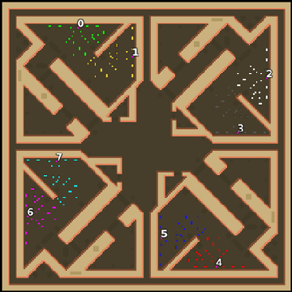

> **ARCHIVED**: This is an archive of an old map / mod from the old Addons site.

### [Map]

> [!IMPORTANT]
> This is an old map format. **Updated versions of maps are available in the Warzone 2100 Maps Database.**

# Mero_Triangular

| | |
| - | - |
| __Author:__ | Merowingg |
| Addon-type: | __Map__ |
| __Game Version:__ | 3.1.0 |
| Created: | March 27, 2013, 4:07 a.m. |
| Oil: | High |
| Players: | 8 |
| Bases: | Advanced Bases |
| __License:__ | CC-BY-SA-3.0 OR GPL-2.0-or-later |

> File: [8cMero_Triangular.wz](https://github.com/Warzone2100/old-addons-site/raw/main/assets/63/8cMero_Triangular.wz)  
> SHA256: fdadbe98892a69bb23a9998c7f03bff7d313f0e55c9212dcb7c64cfde466195a

## Description:

Hello Gentlemen  

The map is not appropriate for FFA if two players of opposite teams are in one corner next to each other.

Some time ago I had this Squared fascination, well.. here we go again  but in a more triangular way    

The map makes players to take care of the centre of the map like in original Squared, there are few junctions, and some long passages leading you to some interesting places  do not hesitate to visit some of the cliffs, as there are old factories there, and not so empty although deserted  

As the triangle shape is leading on this map.. this is my Triangled Squared  

The map is for eight players, the map is for 2v2v2v2 games, or any other games, but it is not appropriate for FFA, if the players are set in four groups of two players very near to each other. But 1v1v1v1 in each corner, and any other combination is good,

There is eight oils in base, and another ten per player around the map. Advanced bases are included with the gateways.

The junctions, and passages enable you to use multiple interesting tactics. Even losing the centre do not stop you entirely from sneaking out and attacking from a surprising point on the map. I advise to visit all the triangles  

Have fun Gentlemen  and don't disappear like in the Bermuda Triangle  

