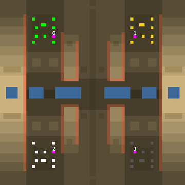

> **ARCHIVED**: This is an archive of an old map / mod from the old Addons site.

### [Map]

> [!IMPORTANT]
> This is an old map format. **Updated versions of maps are available in the Warzone 2100 Maps Database.**

# Mero_Bacteria

| | |
| - | - |
| __Author:__ | Merowingg |
| Addon-type: | __Map__ |
| __Game Version:__ | 3.1.0 |
| Created: | March 27, 2013, 4:07 a.m. |
| Oil: | Low |
| Players: | 4 |
| Bases: | Normal bases |
| __License:__ | CC-BY-SA-3.0 OR GPL-2.0-or-later |

> File: [4cMero_Bacteria.wz](https://github.com/Warzone2100/old-addons-site/raw/main/assets/66/4cMero_Bacteria.wz)  
> SHA256: 991e7c34905898ced4d72a3c5bd845de14b78a427b77ddc8e24dd7179953c728

## Description:

Hello Gentlemen  

It is the smallest map in my history here  

It is 64x64 and I think I do not need to explain its name now here  

The map is for 4 players. A typical rush map. 7 oils per player, I think it is the smallest oil number per player I have ever made too  Gentlemen am I evolving?  Advanced bases are included and gateways are included as well.

Have quick fun  

