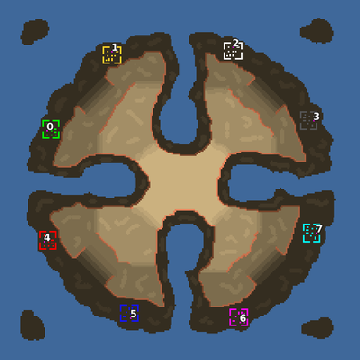

> **ARCHIVED**: This is an archive of an old map / mod from the old Addons site.

### [Map]

> [!IMPORTANT]
> This is an old map format. **Updated versions of maps are available in the Warzone 2100 Maps Database.**

# Mero_CapriXX

| | |
| - | - |
| __Author:__ | Merowingg |
| Addon-type: | __Map__ |
| __Game Version:__ | 3.1.0 |
| Created: | March 27, 2013, 4:07 a.m. |
| Oil: | Medium |
| Players: | 8 |
| Bases: | Advanced Bases |
| __License:__ | CC-BY-SA-3.0 OR GPL-2.0-or-later |

> File: [8cMero_CapriXX.wz](https://github.com/Warzone2100/old-addons-site/raw/main/assets/67/8cMero_CapriXX.wz)  
> SHA256: 1b291e3db0b60dada16c85e676356316c41ae43225936332f04a0892244d261e

## Description:

Hello Gentlemen  

"GOTM" – Good Old Times Maps

This is one of the maps I made at the very beginning of my mapmaking journey but which I have renewed now. By renewed I mean the following things. The amount of oil is reduced to 5 in base and another 7 per player on the map. Very rich texturing is added. Advanced bases and gateways are added. Rich amount of features is added. On four players maps The Scavengers are added. Some terrain changes were made where necessary due to correctness of what is considered to be standard. Almost each map has its four and eight players version. All maps having "GOTM" abbreviation in its description has characteristics mentioned above. When X is at the end of a map name it means it is for four players. When XX is at the end it means it is for eight players.

The Capri map gives you opportunity to try few interesting tactics  

Have fun  

