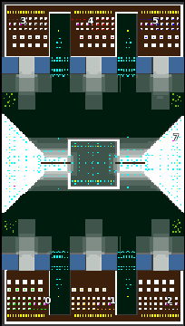

> **ARCHIVED**: This is an archive of an old map / mod from the old Addons site.

### [Map-Mod]

> [!IMPORTANT]
> Mods (or map-mods) **may not work properly or cause crashes / broken behavior** if used with a version of Warzone 2100 other than the one specified below

# FabMountainSquare

| | |
| - | - |
| __Author:__ | Fabio_IT |
| Addon-type: | __Map-Mod__ |
| __Game Version:__ | 3.1.0 [^1] |
| Created: | March 28, 2013, 12:20 p.m. |
| Oil: | High |
| Players: | 6 |
| Bases: | Normal bases |
| Player Mode: | Skrimish/MP |
| Mod Category: | Graphics |
| __License:__ | CC-BY-3.0 OR GPL-2.0-or-later |

> File: [6cFabMountSquare.wz](https://github.com/Warzone2100/old-addons-site/raw/main/assets/69/6cFabMountSquare.wz)  
> SHA256: 6e237f502d5a412f03f6e397e1997adf0cfac67735625bf4341dbf37449c1960

## Description:

30 oils,  scavs medium / hard with 18 extra oils.

Some custom tiles.  Very big map.

[^1]: This archived mod is only tested with this older version of Warzone 2100, and is unlikely to work with more modern versions as-is.
