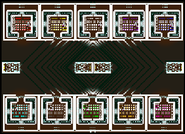

> **ARCHIVED**: This is an archive of an old map / mod from the old Addons site.

### [Map-Mod]

> [!IMPORTANT]
> Mods (or map-mods) **may not work properly or cause crashes / broken behavior** if used with a version of Warzone 2100 other than the one specified below

# FabCrazyScavs

| | |
| - | - |
| __Author:__ | Fabio_IT |
| Addon-type: | __Map-Mod__ |
| __Game Version:__ | 3.1.0 [^1] |
| Created: | March 28, 2013, 12:20 p.m. |
| Oil: | High |
| Players: | 10 |
| Bases: | Advanced Bases |
| Player Mode: | Skrimish/MP |
| Mod Category: | Graphics |
| __License:__ | CC-BY-3.0 OR GPL-2.0-or-later |

> File: [10cFabCrazyScavs3.wz](https://github.com/Warzone2100/old-addons-site/raw/main/assets/70/10cFabCrazyScavs3.wz)  
> SHA256: c43e9d8d0f2e9c75903adcac9259715998b55a3984639b25187c6194ce9b370f

## Description:

This map starts as low oil, and oil becomes high when you kill the scavs.

When scavenger are under attack they running across every base, and they killing and destroy all.

It's really hard survive the first 20 minuts under their attack.

On the middle scavengers with heavvy weapon, and some extra oil.

Don't play this map with bot, it defeat early.

Beautiful marble/candy  tileset made by NoQ here, and beautiful map view.

Not recommended for newbie.

[^1]: This archived mod is only tested with this older version of Warzone 2100, and is unlikely to work with more modern versions as-is.
