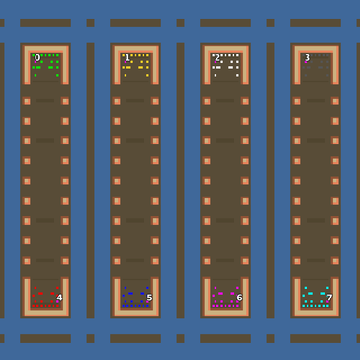

> **ARCHIVED**: This is an archive of an old map / mod from the old Addons site.

### [Map]

> [!IMPORTANT]
> This is an old map format. **Updated versions of maps are available in the Warzone 2100 Maps Database.**

# Mero_NTWSnakes

| | |
| - | - |
| __Author:__ | Merowingg |
| Addon-type: | __Map__ |
| __Game Version:__ | 3.1.0 |
| Created: | March 31, 2013, 12:28 a.m. |
| Oil: | High |
| Players: | 8 |
| Bases: | Advanced Bases |
| __License:__ | CC-BY-SA-3.0 OR GPL-2.0-or-later |

> File: [8cMero_NTWSnakes.wz](https://github.com/Warzone2100/old-addons-site/raw/main/assets/74/8cMero_NTWSnakes.wz)  
> SHA256: 3db61d3196b641a7a1646005cc779074733fd02914b4aff8d3e5976b97712597

## Description:

Hello Gentlemen  

Every Kingdom has its mystic animals and creatures, so here are the first of them  the four snakes are fierce and what is unusual about them is each of them has a head at each end.

The map is 180x180, for eight players, advanced bases are included, but no defence structures as I want the players to decide how to defend on the snakes. gateways are included. Finally it is 18 oils per player. 7 in base. 7 outside, and four on the isles.

The hills on each snake are to help to protect the land, also the small bases are protected by three cliff walls from three sides so a player could feel more safe.

The map can be FAA, but also for any type of game since 1v7 ending with 4v4 and any other combination.

What is more the interesting fact about this map is that it can be played by teams both vertically and horizontally   

!!! I do not type information that hovers or vtols are necessary to finish the game as in fact they are only in situation when the opponents are on different isle. Although it is necessary to state  !!!

Have fun Gentlemen  

