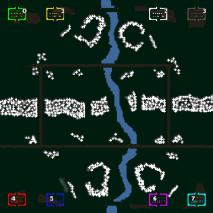

> **ARCHIVED**: This is an archive of an old map / mod from the old Addons site.

### [Map]

> [!IMPORTANT]
> This is an old map format. **Updated versions of maps are available in the Warzone 2100 Maps Database.**

# Mero_MountainsXX

| | |
| - | - |
| __Author:__ | Merowingg |
| Addon-type: | __Map__ |
| __Game Version:__ | 3.1.0 |
| Created: | March 31, 2013, 7:44 a.m. |
| Oil: | Medium |
| Players: | 8 |
| Bases: | Advanced Bases |
| __License:__ | CC-BY-SA-3.0 OR GPL-2.0-or-later |

> File: [8cMero_MountainsXX.wz](https://github.com/Warzone2100/old-addons-site/raw/main/assets/75/8cMero_MountainsXX.wz)  
> SHA256: 53296eb841512626c37fb478ce0e59934f517f12a6c047fb95847607d24083b3

## Description:

Hello Gentlemen  

I was thinking about it long time ago and recently it was JDW who inspired me to! renewing my old maps  It is both great fun and nightmare for me.. because.. it is fun to look again at my first steps and recall things and ideas I was proud of  but at the same time.. redoing it from very old FlaMe 1.02 times caused me a lot of trouble at some points.. and in fact it doo take a lot of time again as my main point is to renew the maps without letting them lost their spirit  

As a result the following description was created which will appear with every renewed by me map.

"GOTM" – Good Old Times Maps

This is one of the maps I made at the very beginning of my mapmaking journey but which I have renewed now. By renewed I mean the following things. 

1)The amount of oil is reduced to 5 in base and another 7 per player on the map. 

2) Very rich texturing is added. Advanced bases and gateways are added. 

2) Rich amount of features is added. 

4) On four players maps The Scavengers are added. 

5) Some terrain changes were made where necessary due to correctness of what is considered to be standard. 

6) Almost each map has its four and eight players version. 

All maps having "GOTM" abbreviation in its description has characteristics mentioned above. When X is at the end of a map name it means it is for four players. When XX is at the end it means it is for eight players.

Also "GOTM" section will be created in the first post of this thread  

When I will finish renewing those about fifteen maps, I will make special pack containing all of them  

I will provide previews of eight player maps only! If there will be only four player map then the screen of the four player map will be provided.

Let's the journey into past begin  

