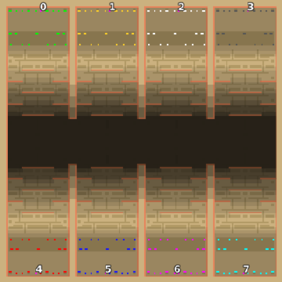

> **ARCHIVED**: This is an archive of an old map / mod from the old Addons site.

### [Map]

> [!IMPORTANT]
> This is an old map format. **Updated versions of maps are available in the Warzone 2100 Maps Database.**

# Mero_NTWForts

| | |
| - | - |
| __Author:__ | Merowingg |
| Addon-type: | __Map__ |
| __Game Version:__ | 3.1.0 |
| Created: | March 31, 2013, 12:28 a.m. |
| Oil: | High |
| Players: | 8 |
| Bases: | Advanced Bases |
| __License:__ | CC-BY-SA-3.0 OR GPL-2.0-or-later |

> File: [8cMero_NTWForts.wz](https://github.com/Warzone2100/old-addons-site/raw/main/assets/78/8cMero_NTWForts.wz)  
> SHA256: 1014dc359bc57a129bd3223f2b5b6258630ea2abd1a29ceb5a8164159c7bb017

## Description:

Hello Gentlemen  

NTW Forts is as you can see almost classic NTW map, but in this case yet another modified by me, all players are located behind terrain helping them to protect their bases or shall I say forts  

The map is 200x200 for eight players. Advanced bases are included although not a single defence structure is used. It is because it is already very easy to turtle so I let it how you will do it up to you.

There is eight oils in each base and another twelve on the way to them. Gateways are included.

It is advisable that the same players were on each side of the valley because there is a place in each base where you can have contact with your neighbours without being allowed to go to them, but if you insist FAA games are still possible without big trouble.

If turtled appropriately the map is for sure for longer games so beware  

Have fun Gentlemen  

